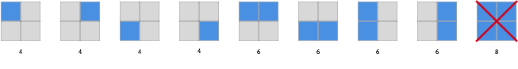

# Rectangle

frog has a piece of paper divided into $n$ rows and $m$ columns.
Today, she would like to draw a rectangle whose perimeter is not greater than $k$.

Find the number of ways of drawing.

## Input

The input consists of multiple tests. For each test:

The first line contains $3$ integer $n, m, k$
($1 \leq n, m \leq 5 \cdot 10^4, 0 \leq k \leq 10^9$).

## Output

For each test, write $1$ integer which denotes the number of ways of drawing.
